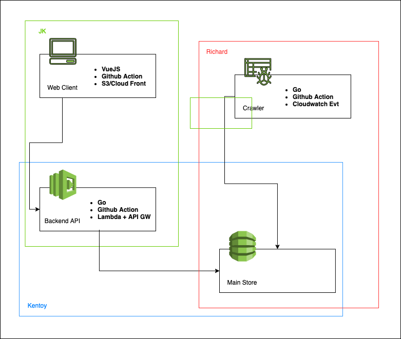

# km-web
Web client for keepmotivat.in



> This will be the initial architecture for the platform.

## Project setup
```sh
$ yarn install
```

### Compiles and hot-reloads for development
```sh
$ yarn serve
```

### Compiles and minifies for production
```sh
$ yarn build
```

### Lints and fixes files
```sh
$ yarn lint
```
